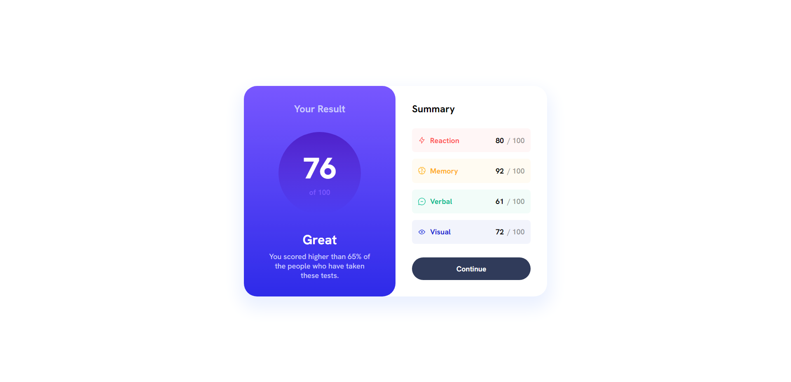
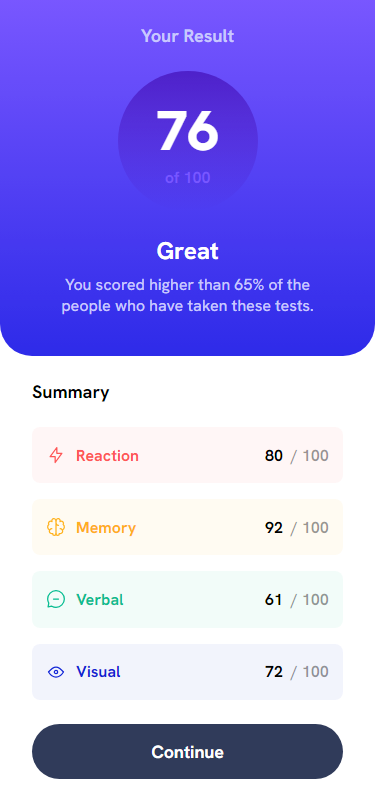

# Frontend Mentor - Results summary component solution

This is a solution to the [Results summary component challenge on Frontend Mentor](https://www.frontendmentor.io/challenges/results-summary-component-CE_K6s0maV). Frontend Mentor challenges help you improve your coding skills by building realistic projects. 

## Table of contents

- [Frontend Mentor - Results summary component solution](#frontend-mentor---results-summary-component-solution)
  - [Table of contents](#table-of-contents)
  - [Overview](#overview)
    - [The challenge](#the-challenge)
    - [Screenshot](#screenshot)
    - [Links](#links)
  - [My process](#my-process)
    - [Built with](#built-with)
    - [What I learned](#what-i-learned)
  - [Author](#author)

**Note: Delete this note and update the table of contents based on what sections you keep.**

## Overview

### The challenge

Users should be able to:

- View the optimal layout for the interface depending on their device's screen size
- See hover and focus states for all interactive elements on the page

### Screenshot




### Links

- Solution URL: [https://github.com/aitorias/result-summary-component](https://github.com/aitorias/result-summary-component)
- Live Site URL: [https://aitorias.github.io/#/frontendmentor/results-summary](https://aitorias.github.io/#/frontendmentor/results-summary)

## My process

### Built with

- Semantic HTML5 markup
- CSS custom properties
- Flexbox
- CSS Grid
- Mobile-first workflow
- [React](https://react.dev/) - JS library

### What I learned

I have learned to design elements using gradients to give a touch of design and modernity to my components.

```css
.userScore {
  align-items: center;
  aspect-ratio: 1/1;
  background: linear-gradient(var(--violet-blue), var(--persian-blue));
  border-radius: 50%;
  display: flex;
  flex-direction: column;
  justify-content: center;
  width: 140px;
}
```

## Author

- Website - [Aitorias](https://aitorias.github.io/)
- Frontend Mentor - [@aitorias](https://www.frontendmentor.io/profile/aitorias)
- LinkedIn - [/in/aitordediego](https://www.linkedin.com/in/aitordediego)
